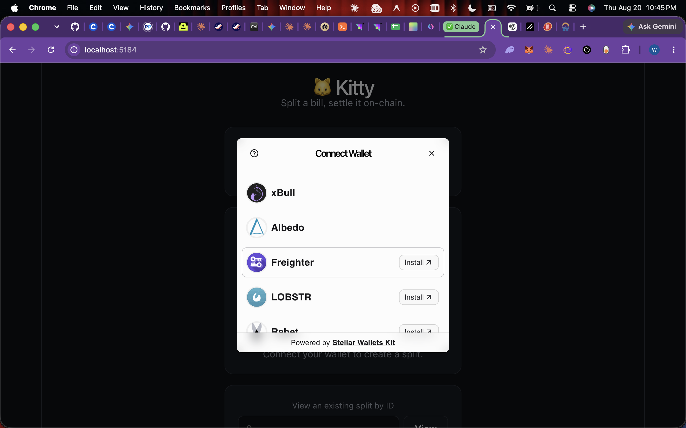
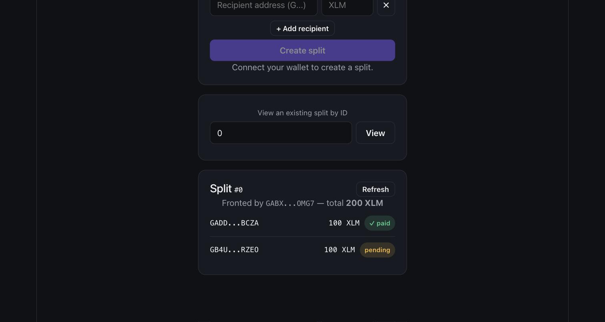
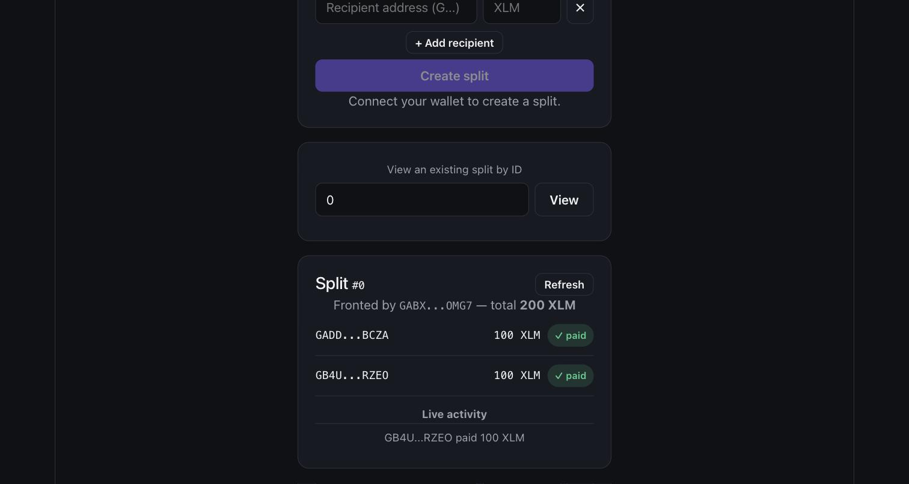

# 🐱 Kitty — Level 2 (Yellow Belt)

Split a bill, settle it on-chain — now with a real Soroban smart contract, multi-wallet support, and live event-driven status updates.

Level 1 sent a plain XLM payment between two wallets. Level 2 moves the actual bill-splitting logic on-chain: a `KittySplit` Soroban contract tracks who owes what, each recipient pays their own share from their own wallet, and the whole app watches the contract's events to update in real time — no manual refreshing needed.

## What it does

- Connect any of several wallets (Freighter, xBull, Albedo, Lobstr, Rabet, Hana) via **StellarWalletsKit**
- Create a bill split on-chain: enter any number of recipients + their share amounts, one `create_split` call
- Any recipient — from their own connected wallet — pays their own share with `pay_share`; the contract transfers native XLM straight from payer to the split's creator
- Read live split state (`get_split`) and watch a real-time activity feed powered by polling the contract's `paid` events, so a payment made from one browser shows up automatically in another
- Surfaces three distinct error types: **wallet not found**, **request rejected in wallet**, **insufficient balance**
- Every transaction shows pending → success/fail status with the tx hash and a link to Stellar Expert

## Contract

- **Language:** Rust / Soroban SDK 27
- **Network:** Stellar Testnet
- **Contract ID:** `CBIOSQCKT53INVR6SF4B5MU7EWH4TH4AMPTD7QXRG6WGWPE3R7JBS5NB`
- **Deploy transaction:** [`15ec9b93599814b687c88a21eb5030f14f6742c4818511b5474333bb3b88de58`](https://stellar.expert/explorer/testnet/tx/15ec9b93599814b687c88a21eb5030f14f6742c4818511b5474333bb3b88de58)
- **Example `pay_share` call (verifiable on-chain):** [`2e11ceafc406a39b1b59a57051b5451bc80ed2df56c12995695b6b998e633d24`](https://stellar.expert/explorer/testnet/tx/2e11ceafc406a39b1b59a57051b5451bc80ed2df56c12995695b6b998e633d24)

Source: [`../contract`](../contract). Deployment notes: [`../contract/DEPLOYMENT.md`](../contract/DEPLOYMENT.md).

Functions: `initialize(native_token)`, `create_split(creator, recipients, amounts) -> split_id`, `pay_share(split_id, payer)`, `get_split(split_id) -> SplitRecord`. Custom errors (`AlreadyPaid`, `NotARecipient`, `RecipientsAmountsMismatch`, etc.) are defined with `#[contracterror]` and covered by unit tests in `contract/contracts/kitty-split/src/test.rs`.

## Tech stack

- React + TypeScript (Vite)
- [`@stellar/stellar-sdk`](https://github.com/stellar/js-stellar-sdk) — RPC client, contract bindings runtime
- [`@creit.tech/stellar-wallets-kit`](https://github.com/Creit-Tech/Stellar-Wallets-Kit) — multi-wallet connect/sign
- TypeScript contract bindings generated with `stellar contract bindings typescript` (see `src/contracts/kitty-split`)

## Setup instructions

### Prerequisites

- Node.js 18+
- A Stellar wallet browser extension (Freighter, xBull, Albedo, Lobstr, Rabet, or Hana), set to **Testnet**
- A funded testnet account (fund yours at `https://friendbot.stellar.org/?addr=YOUR_ADDRESS`)

### Run locally

```bash
npm install
npm run dev
```

Open the printed local URL. Click **Connect Wallet**, pick one from the list, and approve the connection.

### Build

```bash
npm run build
```

### Redeploying the contract yourself

See [`../contract/DEPLOYMENT.md`](../contract/DEPLOYMENT.md) for the full deploy + initialize steps, and update `CONTRACT_ID` in `src/lib/stellar.ts` to point at your own deployment.

## Usage

1. Connect your wallet.
2. **Create a split** — add one or more recipient addresses and how much XLM each owes, then submit. This calls `create_split` on-chain and the app automatically shows the new split.
3. Share the split ID with the people who owe money (or they can look it up themselves under **"View an existing split by ID"**).
4. Each recipient connects their own wallet, opens the split, and clicks **Pay my share** — this calls `pay_share`, which transfers XLM directly to the split's creator and marks that recipient's row `✓ paid`.
5. Every payment — from anyone, in any browser tab — appears in **Live activity** within a few seconds via the app's event-polling loop, and the paid/pending badges update automatically.

## Screenshots

- [x] **Wallet options available** (StellarWalletsKit modal)

  

- [x] **Split state read from the contract** (`get_split`, real testnet data — one recipient paid, one pending)

  

- [x] **Both shares paid + live event feed** (the second payment was made independently via CLI and picked up automatically by the app's event listener — no page reload)

  

## Notes

This level's scope: on-chain split tracking, multi-recipient payment collection, multi-wallet support, and event-driven UI sync — all for native XLM. Stablecoin settlement, cross-border path payments, and social-handle addressing (the full Kitty product vision) remain scoped for later levels.
